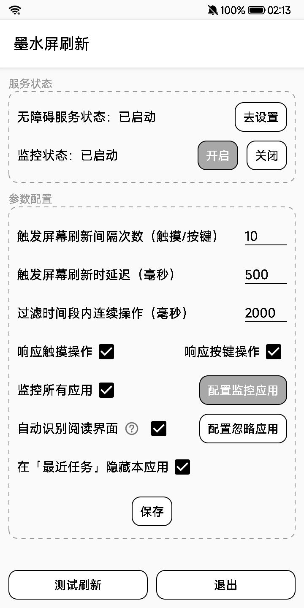
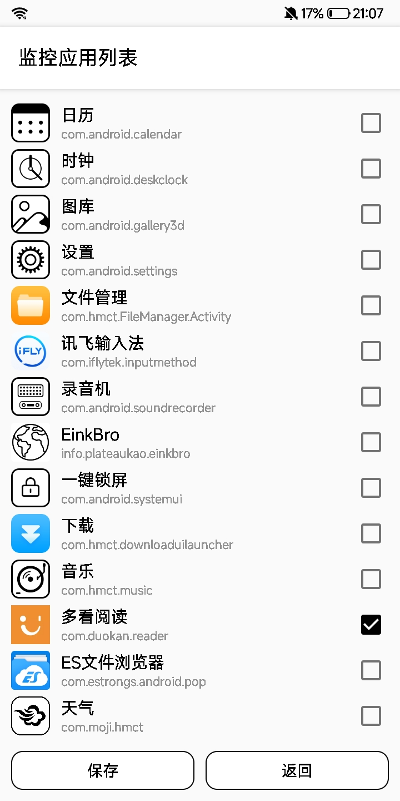

# Hisense E-ink auto refresh

海信墨水屏自动刷新屏幕工具，参考自RefreshAi，由于没有中文所以自己简单做了一款，可以监控在指定APP下的触摸、按键等操作次数，并根据间隔次数刷新墨水屏，可以有效解决阅读时墨水屏残影的问题。

使用方法：

1. 电脑安装adb驱动（请自行搜索下载）

2. 打开开发者选项里的USB调试，并把设备连接到电脑，在弹框询问是否允许USB调试时选择 **允许**

3. 使用cmd执行adb命令  `adb shell settings put global hidden_api_policy 0` 此时屏幕没有任何输出，

   然后再次执行 ` adb shell settings get global hidden_api_policy` 此时屏幕输出 `0` 表示命令执行成功

4. 重启设备，安装apk，授予对应的权限，然后点击 **测试刷新** 当墨水屏能够正常触发刷新代表接口访问正常，此时可以自由配置监控参数。

 
